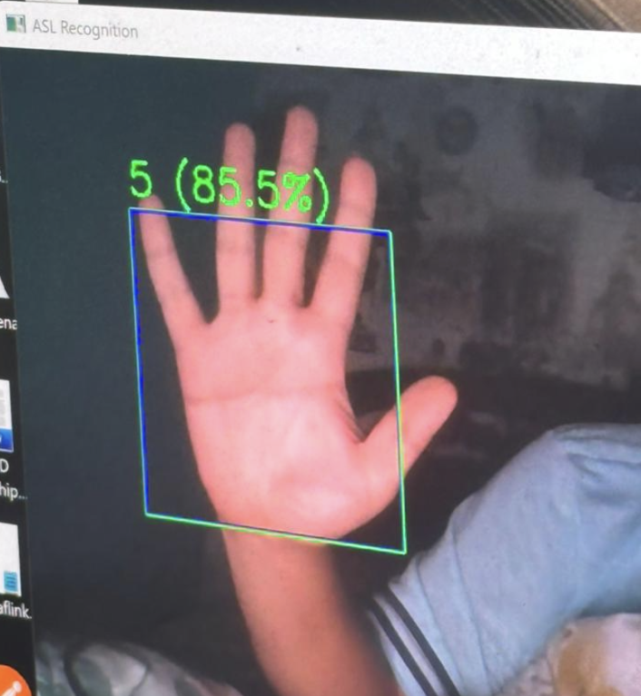
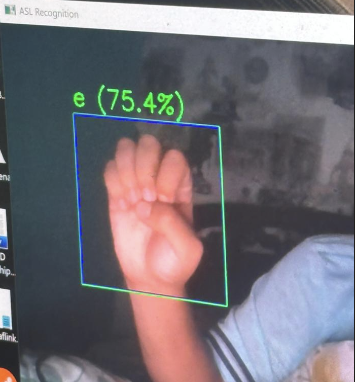

# AI-Powered Sign Language Recognition System

## 📖 Overview
This project is an **AI-powered sign language recognition system** designed to enhance accessibility and communication for individuals with hearing or speech impairments.  
By combining **computer vision** and **deep learning**, the system captures hand gestures through a webcam and translates them into text in real time.  

The goal of this project is to demonstrate how AI can be applied to build inclusive solutions that bridge communication gaps.

---

## ✨ Features
- Real-time hand gesture detection using **OpenCV**
- **Convolutional Neural Network (CNN)** trained to classify sign gestures
- Live video input from webcam
- Instant translation of gestures into text
- Simple interface for real-time feedback
- Dataset can be extended to support more gestures

---

## 🛠️ Tech Stack
- **Programming Language**: Python  
- **Frameworks**: TensorFlow, Keras  
- **Libraries**: OpenCV, NumPy, Pandas, Matplotlib  
- **Dataset**: Custom/preprocessed images of sign gestures  
- **Model**: CNN classifier trained on labeled gesture dataset  

---

## 🚀 Setup Instructions
1. Clone the repository:
   ```bash
   git clone https://github.com/yourusername/sign-language-recognition.git
   cd sign-language-recognition


---
---
## 📸 Demo Screenshots

Below are examples of the system detecting and recognizing hand gestures in real time:

### 1. Recognizing Number "5"


### 2. Recognizing Letter "E" (Live Detection)


### 3. Reference — ASL Letter "E"

---
